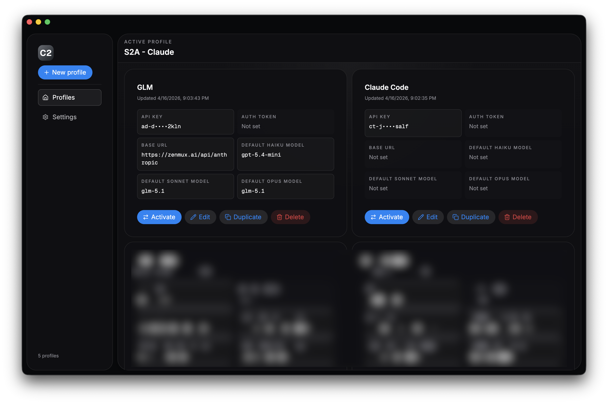

# C2

> 管理多个 Claude Code 配置方案的桌面应用。

[English](./README.md) · [简体中文](./README.zh-CN.md)

C2 是一个 Electron 桌面应用，让你在多个 Claude Code 配置之间自由切换 —— 包括 API Key、Auth Token、Base URL、模型覆盖以及其他高级设置 —— 不再需要手动编辑 `~/.claude/settings.json`。

## 功能特性



- **完全本地，即用即走** - 完全本地化，无需联网，不驻留后台。
- **多配置管理** — 可存储任意数量的凭据方案。
- **一键切换** — 安全地重写 `~/.claude/settings.json`，并自动创建备份（保留最近 5 个）。
- **托管环境变量** — `ANTHROPIC_API_KEY`、`ANTHROPIC_AUTH_TOKEN`、`ANTHROPIC_BASE_URL`、模型覆盖（Haiku / Sonnet / Opus）以及 Claude Code 的高级开关。
- **保留非托管字段** — 未被 C2 管理的其他设置项不会被修改，方便你手动编辑。
- **备份与恢复** — 一键还原最近 5 次的 settings 快照。

## 托管的设置项

C2 会在 `~/.claude/settings.json` 中写入以下环境变量：

| 分类 | 字段                                                                                                                                                                       |
| ---- | -------------------------------------------------------------------------------------------------------------------------------------------------------------------------- |
| 凭据 | `ANTHROPIC_API_KEY`、`ANTHROPIC_AUTH_TOKEN`                                                                                                                                |
| 端点 | `ANTHROPIC_BASE_URL`                                                                                                                                                       |
| 模型 | `ANTHROPIC_DEFAULT_HAIKU_MODEL`、`ANTHROPIC_DEFAULT_SONNET_MODEL`、`ANTHROPIC_DEFAULT_OPUS_MODEL`                                                                          |
| 高级 | `CLAUDE_AUTOCOMPACT_PCT_OVERRIDE`、`CLAUDE_CODE_AUTO_COMPACT_WINDOW`、`CLAUDE_CODE_MAX_OUTPUT_TOKENS`、`CLAUDE_CODE_DISABLE_1M_CONTEXT`、`CLAUDE_CODE_DISABLE_ATTACHMENTS` |

## 安装

前往 [Releases 页面](https://github.com/royli/c2/releases) 下载对应平台的安装包：

- **macOS** — `.dmg`（arm64 或 universal）或 `.zip`
- **Windows** — Squirrel 安装包 (`.exe`)
- **Linux** — `.deb`

## 数据路径

- `~/.config/c2-app` - 配置文件目录
- `~/.claude/settings.json` — Claude Code 设置（C2 写入的目标文件）

## 开发

需要 Node.js 20+ 与 pnpm 10+。

```bash
pnpm install
pnpm dev          # 启动 Electron（热更新）
pnpm typecheck    # TypeScript 严格检查
pnpm lint         # oxlint 静态检查
pnpm format       # oxfmt 格式化
pnpm test         # 运行单元测试（vitest）
pnpm test:e2e     # 运行 Playwright 端到端测试
pnpm make         # 构建各平台安装包
```

运行单个测试文件：`pnpm vitest run path/to/file.test.ts`

### 技术栈

- **外壳**：Electron 41 + Electron Forge + Vite
- **界面**：React 19、React Router、Zustand、HeroUI v3、Tailwind CSS v4
- **表单与校验**：TanStack React Form + Zod
- **测试**：Vitest (jsdom) + Playwright

## 许可证

[MIT](./LICENSE)
